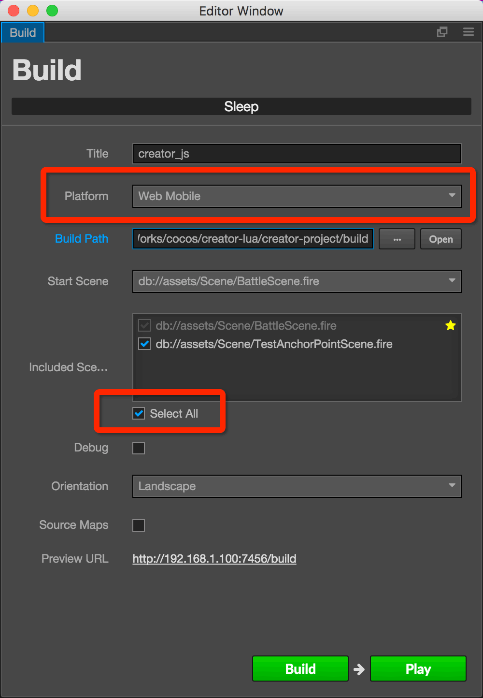

# Cocos Creator Lua Support

## FEATURES

Current supported features:

-   Canvas
-   Sprite
-   Sprite Sheet
-   Widget
-   Button
-   EditBox
-   ParticleSystem
-   TileMap
-   Animation (Basic Frame-Animation)
-   Label (System Font)
-   Component with Lifetime events


## TODO

-   ProgressBar
-   Layout
-   ScrollView
-   Documents


## HOW TO USE


1.  Launch Cocos Creator, open "creator-project"
2.  Select menu "Project -> Build"
3.  Select platform "Web Mobile" and check "Select All"
4.  Click "Build"

    

5.  Open Terminal (**MAC**)
6.  Run:

    ```bash
    cd lua-project
    ./convert-creator-build.sh ../creator-project/build/web-mobile
    ```

7.  Check log:

    ```txt
    [Reader] jsfileSettings = ../../creator-project/build/web-mobile/src/settings.js
    [OK] Copy file ../res/raw-assets/Sprite/box_200x200.png
    [OK] Copy file ../res/raw-assets/Sprite/SheetMapBattle.png
    [OK] Copy file ../res/raw-assets/Sprite/star.png
    [OK] Copy file ../res/raw-assets/Sprite/MapA0002Bg.png
    [OK] write file ../src/assets/scenes.lua
    [OK] write file ../src/assets/assets.lua
    [OK] write file ../src/assets/files.lua
    [OK] write file ../src/assets/prefabs.lua
    done.
    ```

8.  Run :

    ```
    cd lua-project
    cocos run -p mac
    ```

    

### Windows

1.  Run:

    ```bash
    cd lua-project
    convert-creator-build.bat ..\creator-project\build\web-mobile
    ```

