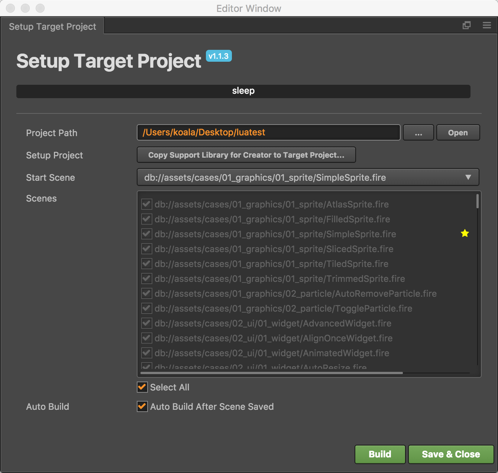

# Cocos Creator 的 Lua 支持

**当前版本 1.1.4，支持 Cocos Creator 1.3.x**

## 目标

让 Lua 开发者可以使用 Cocos Creator 来搭建场景和 UI，并在 Lua 游戏中正常显示和操作。


## 主要特征

当前支持的特征：

-   Sprite - 精灵：图像显示
-   Canvas - 画布：主要用于自动布局
-   Widget - 部件：可以配合 Canvas 设置自动布局和各种对齐方式
-   Button - 按钮：响应玩家操作
-   EditBox - 编辑框：用于玩家输入文字
-   ParticleSystem - 粒子系统：显示粒子效果
-   TileMap - 地图：显示使用 Tiled 编辑的地图
-   Animation - 动画：仅支持帧动画
-   Label (System Font) - 文字标签：仅支持系统字体
-   Component with Lifetime events - 组件及其生命周期管理

Creator 插件功能：

-   设置目标项目（Lua 工程）路径
-   复制需要的支持库到目标项目
-   构建场景数据到目标项目
-   在保存场景时自动构建

## 目前无法支持的功能

一些控件暂时无法支持：

-   ProgressBar
-   Layout
-   ScrollView

## 安装插件

Creator for Lua 1.1 插件提供了 Windows 和 Mac 下的安装程序，执行安装程序瞬间完成安装。

然后，不好意思，没有然后了。JUST DO IT！


## 使用插件

启动 Creator，在场景里啪啪啪放一堆内容，然后选择菜单“工程 -> Lua Support -> Setup Target Project”，就可以看到目标工程设置对话框。



在这个对话框中我们只需要做三个步骤：

1. 点击 Project Path 旁边的 “...” 按钮选择你的 Lua 工程目录；
2. 点击 Copy Support Library 按钮（**这个步骤只需要对每一个新 Lua 工程做一次**）；
3. 点击 Build 按钮。

如果你还没创建 Lua 工程，可以参考下面的命令行：

```bash
$ cocos new -l lua mygame
```

构建出 Lua 代码后，我们就可以愉快的在 Lua 中显示 Creator 创建的场景了。

### 自动构建

默认情况下，并没有启用自动构建功能。所以修改场景后要更新 Lua 代码，需要重新点击 Build 按钮，或者选择菜单“工程 -> Lua Support -> Build Now”。

更省事儿的做法是在对话框中选中 “Auto Build” 选项。这样每次保存场景，就会自动更新 Lua 代码啦。


## 后续计划

-   完善控件库，支持所有 Creator 控件。
-   完善插件，允许从插件中创建 Lua 工程，并自动设置好目标工程。
-   在自动构建时使用增量构建，只构建修改过的场景和资源，提高工作效率。
-   提供完善的使用文档。

