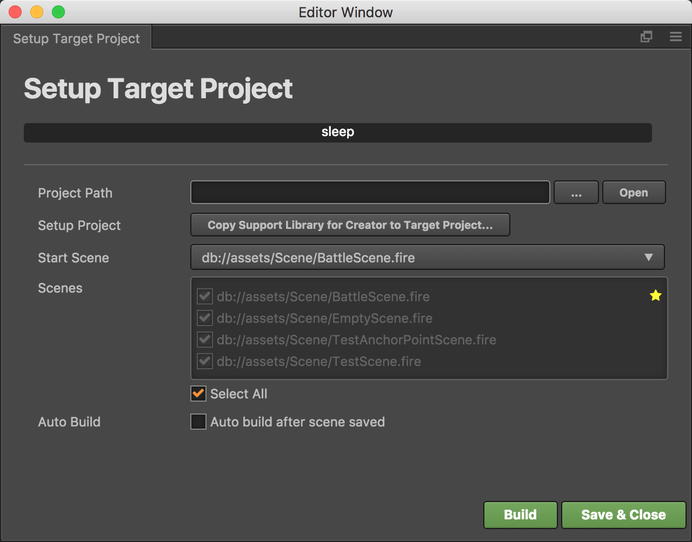

# Cocos Creator 的 Lua 支持

**当前版本 1.1.0**

使用效果：


<br />

## 目标

让 Lua 开发者可以使用 Cocos Creator 来搭建场景和 UI，并在 Lua 游戏中正常显示和操作。

## 主要特征

当前支持的特征：

-   Sprite - 精灵：图像显示
-   Canvas - 画布：主要用于自动布局
-   Widget - 部件：可以配合 Canvas 设置自动布局和各种对齐方式
-   Button - 按钮：响应玩家操作
-   EditBox - 编辑框：用于玩家输入文字
-   ParticleSystem - 粒子系统：显示粒子效果
-   TileMap - 地图：显示使用 Tiled 编辑的地图
-   Animation - 动画：仅支持帧动画
-   Label (System Font) - 文字标签：仅支持系统字体
-   Component with Lifetime events - 组件及其生命周期管理

Creator 插件功能：

-   设置目标项目（Lua 工程）路径
-   复制需要的支持库到目标项目
-   构建场景数据到目标项目
-   在保存场景时自动构建

## 目前无法支持的功能

一些控件暂时无法支持：

-   ProgressBar
-   Layout
-   ScrollView


## 使用说明

1.  创建一个 Lua 工程中：

    ```bash
    cocos new -l lua luaproject
    ```

2.  将 `creator-project/packages/creator-legacy-support` 目录复制到你的 Creator 工程的 `packages` 目录中。如果 `packages` 目录不存在，则需要创建一个。

3.  用 Creator 打开工程，然后选择菜单 "Project（工程） -> Legacy Support -> Setup Target Project"，打开目标工程设置对话框：
    
    

    在这个对话框中选择目标工程的路径，然后点击“Copy Support Library”按钮，将支持 Creator 需要的文件复制到目标工程中（这个操作只需要对每一个目标工程做一次）。

    然后点击“Build”按钮构建场景。

4.  用 Xcode/Visual Studio 打开目标工程执行即可看到场景效果。

~

提示：

-   如果希望每次保存场景后自动更新 Lua 文件，请在设置对话框中选中“Auto Build”选项。
-   对于大型项目，自动构建可能较慢。此时应该禁用自动构建，然后通过菜单“Project（工程） -> Legacy Support -> Build Now”进行构建操作。

~

## 后续计划

-   完善控件库，支持所有 Creator 控件。
-   完善插件，允许从插件中创建 Lua 工程，并自动设置好目标工程。
-   在自动构建时使用增量构建，只构建修改过的场景和资源，提高工作效率。
-   提供完善的使用文档。

